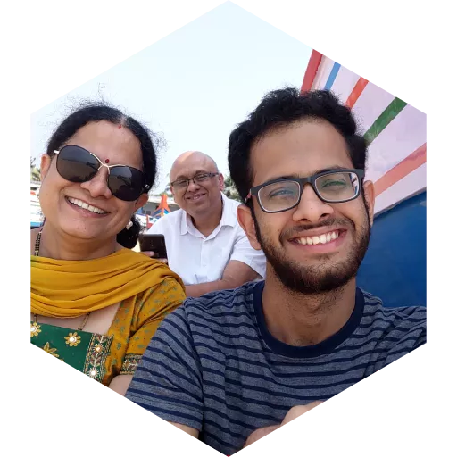

# Dhruva Sambrani's Blog

::: {.centered}

:::

## Who am I?

Hi!

This is a place where I put down my opinions, musings, guides and code. I study Physics at IISER Mohali and am interested in QCQI. I'm also an avid coder in Julia and Python, and I know C++ and a bit of Java. I also have a main [website-cv](https://dhruvasambrani.github.io/) thing which may interest you.

Well, hope you enjoy reading my blog, whether you agree with me or not! Please do reach out via the links on the bottom!

## Contact and Links

[Gemini](gemini://gemini.ctrl-c.club/~dhruva)\
[Mastodon - Tech](https://fosstodon.org/@dhruvasambrani)\
[Mastodon - Academic](https://qubit-social.xyz/@dhruvasambrani)\
[Website/CV](https://dhruvasambrani.github.io)\
Email - See [Website CV](https://dhruvasambrani.github.io)\
[RSS](https://dhruvasambrani.github.io/blog/feed.xml)\

